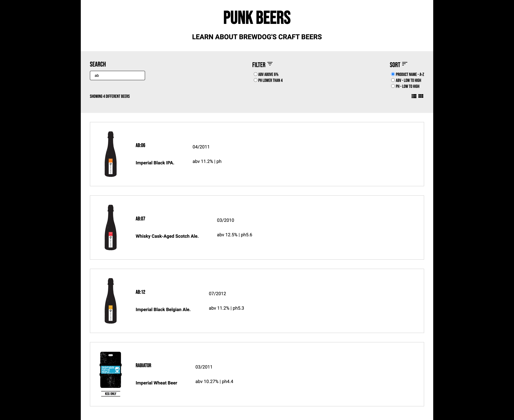

# WEBSITES PUNK

### Overview
A React craft beer website to enable you to search, filter and sort different beers.

### 1. Project's objective
To develop a tool using a test driven development (TDD) where tests are developed before functionalities.

### 2. Design and layout
A screen showing the header, navigation bar (containing the search, filter and sort), and main container which outputs the beer cards.

### 3. Technical development

#### 3.1 Technologies
- HTML/HTML5
- CSS/SCSS
- Javascript/React
- React Testing Library
- NPM
- IDE PHP Storm

#### 3.2 HTML/HTML5
- Uses HTML5 standards i.e. header, nav and main.

#### 3.3 CSS/SCSS
- The SCSS uses B.E.M methodology for naming classes.

#### 3.4 Javascript/React
- Uses _useEffect_ to provide all the beer cards on load.
- Uses _useState_ to change the beers cards based on the search, filter and sort criteria.
- Search is driven by _onInput_ of the beer's name.
- Filtering by ABV above 6% and PH lower than 4 uses _array filters_.
- Sorting by product name A-Z, ABV low to high and ph low to high uses _array filters_ and _sort_.

#### 3.5 React Testing Library
- Test scenarios include:
  - should be a header,
  - should be a search,
  - should be a filter, and
  - should be a sort.
  